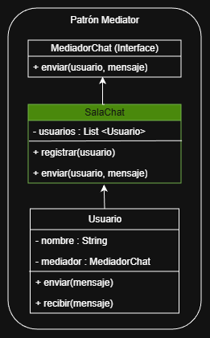

# MediadorChat
# 📌 Patrón de Diseño: Mediator
## Caso de Estudio: Chat Grupal en Java

---

## 📖 1. Descripción del Problema

En un sistema de chat grupal múltiples usuarios pueden enviarse mensajes entre sí.  
Si cada usuario se comunicara directamente con todos los demás, el sistema presentaría:

- Alto acoplamiento entre objetos
- Dependencias múltiples
- Dificultad para escalar
- Mayor complejidad de mantenimiento

Para solucionar esto, se requiere un mecanismo que centralice la comunicación y reduzca las dependencias directas entre usuarios.

---

## 🎯 2. Patrón Seleccionado: Mediator

El patrón **Mediator** es un patrón de comportamiento cuyo objetivo es:

> Definir un objeto que encapsula cómo interactúan un conjunto de objetos, promoviendo el bajo acoplamiento.

En este caso:

- Los usuarios **no se comunican directamente entre sí**.
- La clase **SalaChat** actúa como intermediaria.
- Toda la comunicación pasa por el mediador.

---

## 🏗 3. Estructura del Diseño

### 🔹 MediadorChat (Interface)
Define el contrato de comunicación:
    
    + enviar(usuario, mensaje)

---

### 🔹 SalaChat (Mediator Concreto)

**Atributos:**
    
    + usuarios : List<Usuario>

**Métodos:**

    + registrar(usuario)
    + enviar(usuario, mensaje)

**Responsabilidad:**

    - Registrar usuarios
    - Centralizar la comunicación
    - Distribuir mensajes a los participantes

---

### 🔹 Usuario (Colleague)

**Atributos:**
    
    - nombre : String
    - mediador : MediadorChat

**Métodos:**

    + enviar(mensaje)
    + recibir(mensaje)

**Responsabilidad:**

    - Enviar mensajes a través del mediador
    - Recibir mensajes del mediador
    - No conoce directamente a otros usuarios

---

## 🔍 4. Justificación del Patrón

El patron Mediator reduce el acoplamiento entre objetos, centraliza la
logica de comunicacion y facilita el mantenimiento y escalabilidad del
sistema.

Permite aplicar principios como:

-   Bajo acoplamiento
-   Alta cohesion
-   Responsabilidad Unica
-   Abierto/Cerrado

Los usuarios no dependen entre sí, sino del mediador.

---

## 🏁 5. Conclusión

El patron Mediator es adecuado para un sistema de chat grupal porque
evita dependencias directas entre usuarios y centraliza la comunicacion
en un unico componente (SalaChat).

